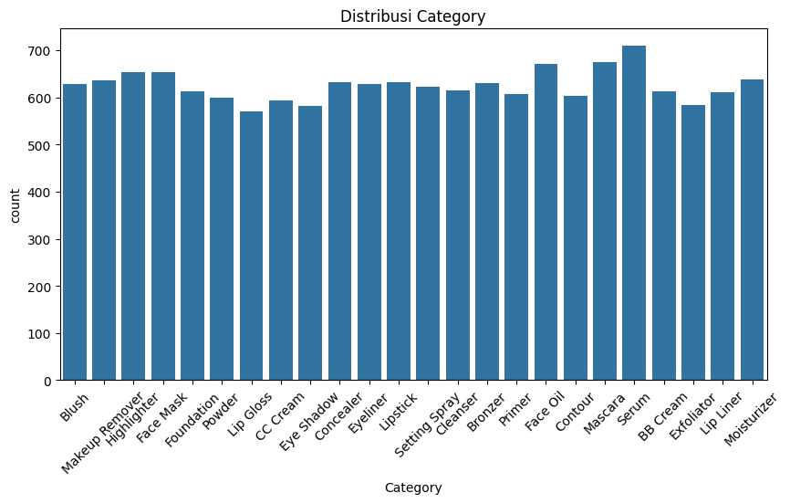

# Laporan Proyek Machine Learning - Aulia Halimatusyaddiah

## Project Overview

Industri kecantikan global diperkirakan mencapai USD 571,10 miliar pada 2023, didorong oleh meningkatnya permintaan produk personal dan belanja daring pasca-COVID-19 (Alibaba, 2023). Namun, konsumen sering menghadapi information overload karena banyaknya produk kecantikan, sehingga sulit memilih yang sesuai dengan kebutuhan kulit mereka, seperti jenis kulit atau masalah spesifik (jerawat, penuaan) (Kim, 2021). Rekomendasi tradisional, seperti produk terlaris, kerap tidak efektif karena tidak mempertimbangkan preferensi individu, menyebabkan ketidakpuasan dan potensi efek samping pada kulit (Lee et al., 2023).

Sistem rekomendasi berbasis content-based dan collaborative filtering diperlukan untuk memberikan solusi personal dengan menganalisis fitur produk (bahan, jenis kulit) dan pola perilaku pengguna (Dakhel & Mahdavi, 2013). Pendekatan ini dapat meningkatkan kepuasan konsumen, konversi penjualan, dan loyalitas merek, sekaligus mengurangi waktu pencarian produk (Crespo et al., 2011). Proyek ini mengembangkan sistem rekomendasi produk kecantikan untuk membantu konsumen menemukan produk yang relevan, mendukung pengalaman belanja yang efisien dan pertumbuhan industri yang kompetitif.

## Business Understanding

### Problem Statements

Menjelaskan pernyataan masalah:
- Bagaimana cara membantu konsumen menemukan produk kecantikan yang sesuai dengan jenis kulit dan masalah kulit mereka di tengah banyaknya pilihan produk di pasar?
- Bagaimana cara menyediakan rekomendasi produk kecantikan yang dipersonalisasi berdasarkan preferensi individu pengguna, seperti jenis kulit atau bahan aktif yang diinginkan?
- Bagaimana cara mengurangi waktu dan usaha konsumen dalam meneliti produk kecantikan untuk menemukan pilihan yang paling relevan dan efektif?

### Goals

Menjelaskan tujuan proyek yang menjawab pernyataan masalah:
- Menyediakan Rekomendasi yang Relevan dengan menyarankan produk kecantikan yang sesuai dengan jenis kulit (misalnya, sensitif, berminyak) dan masalah kulit pengguna, berdasarkan fitur produk seperti bahan utama dan kategori.
- Meningkatkan Personalisasi dengan membangun sistem yang memanfaatkan data preferensi pengguna dari ratings_df dan karakteristik produk untuk memberikan rekomendasi yang disesuaikan dengan kebutuhan individu.
- Mengoptimalkan Efisiensi Belanja dengan menciptakan sistem yang memberikan rekomendasi cepat dan akurat, sehingga mengurangi waktu penelitian konsumen dan meminimalkan pengembalian produk.

### Solution statements
Untuk mencapai tujuan di atas, proyek ini menerapkan dua pendekatan utama dalam sistem rekomendasi yang telah diimplementasikan:
- Content-Based Filtering  
Pendekatan ini menjawab pertanyaan masalah dengan menganalisis fitur produk seperti nama produk, merek, kategori, bahan utama, dan jenis kulit menggunakan TF-IDF (Term Frequency-Inverse Document Frequency) dan cosine similarity untuk merekomendasikan produk serupa dengan yang telah disukai pengguna. Sistem memfilter produk yang belum diinteraksikan berdasarkan ratings_df. Memberikan rekomendasi yang sangat relevan untuk kebutuhan spesifik, seperti produk dengan retinol untuk anti-penuaan atau cocok untuk kulit sensitif, sehingga menjawab kebutuhan personalisasi.
- Collaborative Filtering  
Pendekatan ini menjawab pertanyaan masalah dengan memprediksi rating produk yang belum diinteraksikan pengguna berdasarkan pola rating pengguna lain, menggunakan Random Forest Regressor pada fitur terenkode seperti merek, kategori, dan jenis kulit. Sistem memanfaatkan ratings_df untuk mengidentifikasi preferensi pengguna. Efektif untuk merekomendasikan produk populer di kalangan pengguna dengan preferensi serupa, meningkatkan cakupan rekomendasi dan efisiensi belanja.

## Data Understanding
Dataset yang digunakan adalah most_used_beauty_cosmetics_products_extended.csv, yang berisi informasi produk kecantikan, serta dataset tambahan ratings_df yang dibuat secara sintetis untuk merepresentasikan preferensi pengguna. Dataset ini memiliki 15.000 entri dengan 14 fitur bertipe data yang sesuai tanpa nilai hilang (non-null), menunjukkan kondisi data yang bersih dan siap digunakan. Dataset ini bersumber dari Kaggle dengan domain tautan sebagai berikut: https://www.kaggle.com/datasets/waqi786/most-used-beauty-cosmetics-products-in-the-world.

Variabel-variabel pada dataset adalah sebagai berikut:
- Product_Name: Variabel yang berisi nama produk kecantikan (contoh: Super Foundation).
- Brand: Variabel yang berisi Merek produk (contoh: Charlotte Tilbury).
- Category: Variabel yang berisi kategori produk (contoh: Highlighter, Blush, Face Mask).
- Usage_Frequency: Variabel yang berisi frekuensi penggunaan produk (contoh: Daily, Weekly, Occasional).
- Price_USD: Variabel yang berisi harga produk dalam USD (rentang: 10.00–149.99, rata-rata: 80.13).
- Rating: Variabel yang berisi rating rata-rata produk (skala 1.0–5.0, rata-rata: 3.00).
- Number_of_Reviews: Variabel yang berisi jumlah ulasan produk (rentang: 52–10.000, rata-rata: 5.014).
- Product_Size: Variabel yang berisi ukuran produk (contoh: 30ml, 100ml, 250ml).
- Skin_Type: Variabel yang berisi jenis kulit yang ditargetkan (contoh: Sensitive, Dry, Oily, Normal).
- Gender_Target: Variabel yang berisi target gender produk (contoh: Female, Male, Unisex).
- Packaging_Type: Variabel yang berisi jenis kemasan produk (contoh: Tube, Bottle, Compact).
- Main_Ingredient: Variabel yang berisi bahan utama produk (contoh: Retinol, Shea Butter, Glycerin).
- Cruelty_Free: Variabel yang berisi status bebas dari pengujian hewan (True/False).
- Country_of_Origin: Variabel yang berisi negara asal produk (contoh: Australia, South Korea).

### Exploratory Data Analysis (EDA)

- Memeriksa deskripsi dataset  
Hasil ringkasan statistik deskriptif dari DataFrame menggunakan fungsi df.describe() untuk tiga kolom: Price_USD, Rating, dan Number_of_Reviews. Masing-masing kolom memiliki 15.000 data. Rata-rata harga adalah sekitar $80,13 dengan standar deviasi $40,40, menunjukkan variasi harga yang cukup besar antara produk. Nilai rating rata-rata adalah 3,00 dari skala 1 hingga 5, dengan persebaran yang tidak terlalu besar (standar deviasi 1,17). Sementara itu, jumlah ulasan memiliki rata-rata sekitar 5.014 dengan standar deviasi 2.855, menandakan bahwa sebagian produk mendapatkan jauh lebih banyak ulasan dibanding yang lain. Rentang nilai minimum hingga maksimum di ketiga kolom menunjukkan adanya variasi besar antar item, misalnya ada produk yang memiliki hingga 100.000 ulasan.
- Memeriksa distribusi fitur numerik  

Price_USD: Harga produk bervariasi dengan rata-rata USD 80.13 dan standar deviasi USD 40.40, menunjukkan rentang harga yang lebar dari produk terjangkau hingga premium. Produk dengan harga di bawah USD 50 dan di atas USD 100 cukup banyak, mencerminkan keragaman segmen pasar (terjangkau vs. mewah), yang relevan untuk personalisasi rekomendasi berdasarkan anggaran pengguna.  
Rating: Rating rata-rata produk adalah 3.00 (skala 1.0–5.0) dengan standar deviasi 1.17, mengindikasikan variasi kepuasan pengguna. Sekitar 25% produk memiliki rating ≥ 4.0, yang relevan untuk menentukan relevance threshold (4.0) dalam evaluasi. Rating produk cenderung terdistribusi merata, dengan sedikit produk mencapai rating 5.0. Ini menunjukkan perlunya sistem rekomendasi yang fokus pada produk dengan rating tinggi untuk meningkatkan kepuasan pengguna.  
Number_of_Reviews: Jumlah ulasan rata-rata 5.014, dengan maksimum 10.000, menunjukkan beberapa produk sangat populer. Hal ini dapat memengaruhi rekomendasi berbasis popularitas dalam collaborative filtering.  
**Distribusi Fitur Kategorikal**
-Memeriksa distribusi fitur kategorikal  

Grafik batang tersebut menunjukkan distribusi jumlah produk berdasarkan kategori dalam dataset kosmetik. Secara umum, semua kategori memiliki jumlah produk yang relatif seimbang, berkisar antara sekitar 580 hingga lebih dari 700 produk. Kategori dengan jumlah produk terbanyak adalah Serum, disusul oleh Mascara dan Face Oil, yang masing-masing memiliki lebih dari 680 produk. Sementara kategori dengan jumlah produk paling sedikit adalah Powder, Lip Gloss, dan Exfoliator. Grafik ini menggambarkan bahwa meskipun variasi antar kategori tidak terlalu ekstrem, ada beberapa kategori yang lebih dominan dalam hal jumlah produk yang tersedia dalam dataset.
- Memeriksa distribusi fitur jenis kulit  

Grafik batang ini menunjukkan distribusi produk berdasarkan jenis kulit (Skin_Type) dalam dataset. Terdapat lima kategori jenis kulit: Sensitive, Dry, Normal, Oily, dan Combination. Masing-masing kategori memiliki jumlah produk yang sangat seimbang, dengan jumlah sekitar 2950 hingga 3050 produk per kategori. Hal ini menunjukkan bahwa dataset memiliki representasi yang merata untuk setiap jenis kulit, yang dapat membantu dalam analisis yang adil dan tidak bias terhadap tipe kulit tertentu, serta memastikan bahwa rekomendasi atau analisis lebih inklusif untuk semua jenis kulit.
- Memeriksa distribusi tipe kemasan produk  

Grafik batang ini menampilkan distribusi jumlah produk berdasarkan jenis kemasan (Packaging_Type) dalam dataset. Terdapat enam jenis kemasan: Tube, Bottle, Compact, Jar, Spray, dan Stick. Secara umum, distribusi antar jenis kemasan cukup merata dengan jumlah produk berkisar antara sekitar 2.400 hingga 2.560. Jenis kemasan Jar memiliki jumlah produk terbanyak, diikuti oleh Bottle, Spray, dan Stick, sementara Tube memiliki jumlah produk paling sedikit. Hal ini menunjukkan bahwa produk kosmetik dalam dataset ini tersedia dalam berbagai bentuk kemasan dengan distribusi yang relatif seimbang, meskipun beberapa jenis kemasan sedikit lebih umum digunakan daripada yang lain.
- Memeriksa distribusi target gender  

Grafik batang ini menggambarkan distribusi produk berdasarkan target gender (Gender_Target) dalam dataset. Terdapat tiga kategori: Female, Unisex, dan Male, yang masing-masing memiliki jumlah produk yang hampir sama, yaitu sekitar 5.000 produk per kategori. Distribusi yang merata ini menunjukkan bahwa dataset cukup seimbang dalam mewakili produk-produk kosmetik untuk semua jenis gender, baik khusus untuk perempuan, laki-laki, maupun yang dapat digunakan oleh semua gender (unisex). Keseimbangan ini penting untuk memastikan bahwa analisis atau rekomendasi produk tidak bias terhadap satu kelompok gender tertentu.
- Memeriksa distribusi komposisi produk  

Grafik ini menunjukkan distribusi produk kosmetik berdasarkan Main_Ingredient atau bahan utama yang digunakan. Terdapat tujuh bahan utama yang cukup populer dan memiliki jumlah produk yang hampir seimbang: Retinol, Shea Butter, Aloe Vera, Glycerin, Hyaluronic Acid, Vitamin C, dan Salicylic Acid. Meskipun tidak ada bahan yang dominan secara signifikan, Retinol dan Glycerin sedikit lebih sering digunakan dibandingkan yang lain, menunjukkan preferensi formulasi terhadap bahan aktif yang dikenal efektif untuk perawatan kulit. Distribusi yang merata ini mencerminkan keragaman formulasi dalam produk kosmetik untuk memenuhi kebutuhan berbagai jenis kulit dan permasalahan kulit yang berbeda.
- Memeriksa distirbusi frekuensi penggunaan produk  

Grafik ini menggambarkan distribusi produk kosmetik berdasarkan Usage_Frequency atau frekuensi penggunaan. Empat kategori frekuensi—Daily (harian), Weekly (mingguan), Monthly (bulanan), dan Occasional (kadang-kadang)—memiliki jumlah produk yang hampir merata, tanpa perbedaan signifikan di antara masing-masing kategori. Hal ini menunjukkan bahwa produk kosmetik dirancang untuk berbagai pola penggunaan sesuai kebutuhan konsumen, mulai dari penggunaan harian yang intensif hingga penggunaan sesekali. Keseimbangan ini mencerminkan keragaman gaya hidup pengguna dan fleksibilitas produk dalam menyesuaikan diri dengan preferensi frekuensi pemakaian.
- Memeriksa distribusi pengujian produk  

Grafik ini menunjukkan distribusi produk kosmetik berdasarkan label Cruelty-Free, yaitu apakah produk diuji pada hewan atau tidak. Terdapat dua kategori: True (Cruelty-Free) dan False (tidak Cruelty-Free), dengan jumlah yang hampir seimbang. Produk yang tidak berlabel Cruelty-Free sedikit lebih banyak dibandingkan yang berlabel Cruelty-Free. Hal ini menunjukkan bahwa meskipun kesadaran terhadap etika pengujian hewan cukup tinggi, masih ada proporsi signifikan dari produk kosmetik yang belum mengadopsi prinsip bebas uji hewan, sehingga dapat menjadi perhatian bagi konsumen yang peduli terhadap isu keberlanjutan dan kesejahteraan hewan.
- Memeriksa distribusi negara asal produk  

Grafik ini menunjukkan distribusi produk kosmetik berdasarkan Country_of_Origin atau negara asal. Delapan negara yang ditampilkan—Australia, UK, Italy, South Korea, Germany, Japan, USA, dan France—memiliki jumlah produk yang hampir seimbang, dengan sedikit keunggulan pada produk asal Italia dan USA. Hal ini mencerminkan bahwa industri kosmetik bersifat global, dengan kontribusi yang signifikan dari berbagai negara maju di Asia, Eropa, dan Amerika. Sebaran yang merata ini juga menunjukkan bahwa konsumen memiliki akses luas terhadap produk dari berbagai negara, memungkinkan keberagaman pilihan dalam kualitas, inovasi, dan preferensi budaya.
- Memeriksa korelasi fitur numerik  

Heatmap korelasi ini menunjukkan hubungan antar fitur numerik: Price_USD, Rating, dan Number_of_Reviews. Hasilnya memperlihatkan bahwa ketiga fitur tersebut memiliki korelasi yang sangat lemah satu sama lain, dengan nilai mendekati nol. Artinya, harga produk, rating, dan jumlah ulasan cenderung saling independen dan tidak memiliki hubungan linear yang signifikan, sehingga perubahan pada satu fitur tidak bisa digunakan untuk memprediksi fitur lainnya secara langsung.
- Memeriksa distribusi fitur kategori terhadap rating produk  

Gambar tersebut menunjukkan boxplot distribusi rating untuk berbagai kategori produk kecantikan. Setiap kotak merepresentasikan sebaran rating produk dalam satu kategori, dengan garis tengah sebagai median. Mayoritas kategori memiliki median rating sekitar 3 hingga 3.5, menunjukkan bahwa sebagian besar produk mendapat penilaian cukup baik. Namun, ada variasi lebar boxplot yang mengindikasikan perbedaan penyebaran rating antar kategori, misalnya kategori seperti "Contour" tampak memiliki persebaran rating yang lebih tinggi. Hal ini membantu mengidentifikasi kategori produk dengan konsistensi dan kualitas yang lebih stabil menurut ulasan pengguna.

## Data Preparation
Pada tahap ini, dilakukan beberapa langkah data preparation untuk mempersiapkan data sebelum digunakan dalam proses modeling, terutama untuk sistem rekomendasi produk berbasis konten (content-based filtering). Teknik-teknik data preparation yang diterapkan mencakup encoding data kategorikal serta ekstraksi fitur teks dan perhitungan kemiripan produk.

### Label Encoding untuk Fitur Kategorikal
Fitur kategorikal yang bersifat non-numerik seperti Brand, Category, Skin_Type, Main_Ingredient, dan Usage_Frequency diubah menjadi bentuk numerik menggunakan teknik Label Encoding melalui LabelEncoder dari sklearn.preprocessing.

### Pembuatan DataFrame Rating
DataFrame ratings_df yang berisi data simulasi dummy ulasan pengguna terhadap produk kecantikan. Terdapat dua pengguna (user_10 dan user_11) yang masing-masing memberikan rating terhadap beberapa produk, dengan mencantumkan nama produk (Product_Name), merek (Brand), dan nilai rating numerik. Data ini berfungsi sebagai input eksplisit dalam sistem rekomendasi, di mana preferensi pengguna terhadap produk tertentu dapat digunakan untuk merekomendasikan produk lain yang relevan.

### Ekstraksi Fitur Teks dengan TF-IDF
Untuk membangun sistem rekomendasi berbasis konten (content-based), digunakan metode TF-IDF (Term Frequency-Inverse Document Frequency) dari sklearn.feature_extraction.text.TfidfVectorizer.

### Perhitungan Cosine Similarity
Hasil dari TF-IDF matrix kemudian digunakan untuk menghitung cosine similarity untuk mengidentifikasi produk lain yang mirip dengan preferensi pengguna.

## Modeling
Tahapan modeling bertujuan untuk mengembangkan sistem rekomendasi yang dapat membantu pengguna menemukan produk kecantikan yang paling sesuai dengan kebutuhan mereka. Dalam proyek ini, dua pendekatan algoritma yang berbeda diimplementasikan untuk menghasilkan rekomendasi top-N, yaitu Content-Based Filtering dan Collaborative Filtering.

### Content Based Filtering
Pendekatan pertama, Content-Based Filtering, merekomendasikan produk berdasarkan kemiripan fitur atau atribut produk itu sendiri. Sistem ini tidak memerlukan data dari pengguna lain, melainkan fokus pada karakteristik produk yang pernah disukai atau sedang dilihat oleh pengguna.

#### Langkah-Langkah Implementasi 
- Kombinasi Fitur  
Fitur-fitur produk yang relevan seperti 'brand', 'Category', dan 'Product_Name' digabungkan menjadi satu teks deskriptif ('result') untuk setiap produk. Ini bertujuan untuk menangkap esensi produk secara komprehensif.
- TF-IDF Vectorization  
Term Frequency-Inverse Document Frequency (TF-IDF) Vectorizer digunakan untuk mengubah teks 'Combined_Features' menjadi representasi numerik (vektor). TF-IDF memberikan bobot pada kata-kata yang penting dalam mendeskripsikan suatu produk relatif terhadap keseluruhan dataset produk.
- Perhitungan Kemiripan Kosinus (Cosine Similarity)  
Setelah mendapatkan matriks TF-IDF, kemiripan antar produk dihitung menggunakan cosine similarity. Metrik ini mengukur kosinus sudut antara dua vektor produk, di mana skor yang lebih tinggi menunjukkan kemiripan yang lebih besar.
- Pembuatan Fungsi Rekomendasi  
Fungsi content_based_recommendations(product_name, brand, top_n=5) dibuat untuk menghasilkan rekomendasi. Fungsi ini mengambil nama produk sebagai input, mencari produk tersebut dalam matriks kemiripan, dan mengembalikan top_n produk lain yang paling mirip. Dalam notebook, fungsi ini dipanggil melalui get_recommendations_and_evaluate yang kemudian mencetak hasilnya dalam bentuk tabel.

#### Kelebihan Content Based Filtering
-Dapat merekomendasikan item baru yang belum memiliki interaksi pengguna (mengatasi item cold-start jika fitur item tersedia).
-Rekomendasi bersifat spesifik terhadap preferensi pengguna berdasarkan fitur produk yang disukainya.
-Tidak memerlukan data dari pengguna lain, sehingga lebih menjaga privasi.

#### Kekurangan Content Based Filtering
-Terbatas pada fitur produk yang ada; jika fitur kurang deskriptif, kualitas rekomendasi menurun.
-Kurang mampu memberikan rekomendasi yang mengejutkan atau beragam (serendipity) karena cenderung merekomendasikan produk yang sangat mirip dengan yang sudah dikenal pengguna (overspecialization).
-Membutuhkan domain knowledge yang baik untuk mengekstrak fitur yang relevan.

### Collaborative Filtering
Pendekatan kedua adalah Model-Based Collaborative Filtering. Berbeda dengan memory-based collaborative filtering yang menghitung kemiripan antar pengguna atau item secara langsung dari data historis, pendekatan model-based membangun sebuah model prediktif dari data rating pengguna. Dalam kasus ini, model yang digunakan adalah Random Forest Regressor.

#### Langkah-Langkah Implementasi
- Pembagian Data  
Data fitur X dan target y (rating) dibagi menjadi set pelatihan dan pengujian menggunakan train_test_split dengan perbandingan 80:20. random_state=42 digunakan untuk memastikan hasil pembagian yang konsisten.
- Pelatihan Model Random Forest  
Sebuah model RandomForestRegressor diinisialisasi dan dilatih. Model ini menggunakan fitur-fitur dari data pelatihan (X_train) untuk memprediksi Rating (y_train). Fitur X_train ini idealnya mencakup informasi yang memungkinkan model mempelajari preferensi pengguna terhadap item ('Brand_Encoded', 'Category_Encoded', 'Skin_Type_Encoded', 'Main_Ingredient_Encoded', 'Usage_Frequency_Encoded' untuk memprediksi rating berdasarkan atribut produk yang disukai pengguna). Parameter yang digunakan dalam kode adalah n_estimators=50: jumlah pohon dalam forest diatur menjadi 50 random_state=42: untuk reproduktifitas hasil, n_jobs=-1: menggunakan semua prosesor yang tersedia untuk paralelisasi proses pelatihan, yang dapat mempercepat training.
- Pembuatan Fungsi Rekomendasi  
Fungsi collaborative_recommendations(user_id, top_n=5) digunakan untuk menghasilkan rekomendasi produk bagi user_id tertentu. Melalui mekanisme chace, Fungsi ini pertama-tama memeriksa apakah rekomendasi untuk user_id sudah ada di recommendation_cache. Jika ya, rekomendasi yang sudah ada dikembalikan untuk efisiensi. Untuk mempersempit jumlah kandidat, fungsi ini memfilter candidates berdasarkan kategori produk yang pernah diberi rating tinggi (>= 4.0) oleh pengguna. Ini membantu memberikan rekomendasi yang lebih relevan dengan preferensi kategori pengguna. Jika jumlah kandidat masih terlalu besar (lebih dari max_candidates = 1000), sampel acak diambil untuk prediksi demi efisiensi. Dalam fungsi ini, fitur yang digunakan untuk prediksi pada item kandidat adalah atribut produk yang sudah di-encode: ['Brand_Encoded', 'Category_Encoded', 'Skin_Type_Encoded', 'Main_Ingredient_Encoded', 'Usage_Frequency_Encoded']. Ini mengimplikasikan bahwa model RandomForestRegressor telah mempelajari bagaimana preferensi rating pengguna (dari data y_train) berkorelasi dengan fitur-fitur produk ini (dari data X_train). Jika pengguna memiliki item yang pernah dirating tinggi, skor prediksi rating dari Random Forest ditingkatkan berdasarkan rata-rata skor kesamaan kosinus (cosine_sim) antara item kandidat dengan item-item yang pernah dirating tinggi oleh pengguna. Produk-produk kandidat kemudian diurutkan berdasarkan prediksi rating tertinggi (setelah boosting), dan top_n produk teratas dikembalikan sebagai rekomendasi.

#### Kelebihan Model-Based Collaborative Filtering (Random Forest)
- Mampu menangani data yang sparse lebih baik daripada beberapa metode memory-based karena melakukan generalisasi dari data yang ada.
- Prediksi rating bisa lebih akurat karena model mempelajari pola yang kompleks dari data.
- Setelah model dilatih, proses pembuatan rekomendasi bisa lebih cepat untuk pengguna baru atau saat ada banyak item, karena tidak perlu menghitung ulang kemiripan dengan semua pengguna/item lain secara real-time.

#### Kekurangan Model-Based Collaborative Filtering (Random Forest)
- Proses pelatihan model bisa memakan waktu dan sumber daya komputasi yang signifikan, terutama dengan dataset besar.
- Model bersifat black box (kurang interpretatif) dibandingkan dengan metode memory-based yang lebih mudah dijelaskan mengapa suatu item direkomendasikan.
- Membutuhkan rekayasa fitur dan pemilihan model yang tepat; performa sangat bergantung pada kualitas model.
- Masih menghadapi masalah user cold-start: jika pengguna baru tidak memiliki data interaksi sama sekali, model tidak dapat membuat prediksi yang akurat untuknya tanpa adanya fitur pengguna tambahan.

## Evaluation
Tahap evaluasi bertujuan untuk mengukur performa dari model-model sistem rekomendasi yang telah dikembangkan, yaitu Content-Based Filtering dan Collaborative Filtering (berbasis model Random Forest). Metrik evaluasi yang dipilih disesuaikan dengan konteks permasalahan, yaitu memberikan rekomendasi produk yang relevan dari sejumlah kecil produk teratas (top-N recommendation).

### Metrik Evaluasi yang Digunakan
Fungsi evaluate_recommendations digunakan untuk menghitung tiga metrik utama pada K=5 (artinya kita mengevaluasi 5 item teratas yang direkomendasikan). Sebuah produk dianggap "relevan" bagi pengguna jika pengguna tersebut memberikan rating ≥4.0 pada produk tersebut (relevance_threshold=4.0).

#### Precision@K
Precision@K mengukur seberapa banyak item yang direkomendasikan dalam K item teratas yang benar-benar relevan bagi pengguna. Metrik ini penting untuk memahami akurasi dari item yang paling terlihat oleh pengguna.
- Formula  
- Cara kerja  
Jika dari 5 item yang direkomendasikan (K=5), ada 3 item yang memang relevan (sesuai dengan history dan rating pengguna ≥0.4), maka Precision@5 adalah 3/5=0.6. Nilai yang lebih tinggi menunjukkan bahwa lebih banyak rekomendasi di posisi teratas yang berguna.

#### Recall@K
Recall@K mengukur seberapa banyak item yang relevan bagi pengguna yang berhasil direkomendasikan dalam K item teratas, dari keseluruhan item yang relevan untuk pengguna tersebut.
- Formula  
- Cara kerja  
Jika pengguna memiliki total 10 item yang dianggap relevan baginya, dan 3 di antaranya muncul dalam 5 rekomendasi teratas, maka Recall@5 adalah 3/10=0.3. Metrik ini menunjukkan kemampuan model untuk menemukan semua item yang mungkin disukai pengguna.

#### Normalized Discounted Cumulative Gain (NDCG@K)
NDCG@K adalah metrik yang mengevaluasi kualitas peringkat dari rekomendasi. Tidak hanya memperhitungkan jumlah item relevan yang direkomendasikan, tetapi juga posisi item relevan tersebut dalam daftar rekomendasi. Item relevan yang muncul di posisi lebih atas mendapatkan bobot lebih tinggi.
- Formula  
- Cara kerja  
NDCG@K memberikan penalti jika item relevan muncul di posisi bawah dalam daftar rekomendasi. Misalnya, merekomendasikan item relevan di posisi 1 lebih baik daripada di posisi 5.

### Hasil Evaluasi

#### Evaluasi Content Based Filtering (Dievaluasi untuk rekomendasi berdasarkan product_id_input=1 terhadap preferensi user_id=user_10)
- Precision@K = 0.2
- Recall@K = 0.2
- F1@K = 0.2
- NDCG@K = 1

#### Evaluasi Collaborative Filtering (Dievaluasi untuk rekomendasi bagi user_id=user_10)
- Precision@K = 0.2
- Recall@K = 0.2
- F1@K = 0.2
- NDCG@K = 0.430677

## Hasil Inference (Terhadap preferensi user_id=user_10 product_name="Super Foundation", dan brand="Charlotte Tilbury")

### Content Based Filtering
| No | Product_Name        | Brand             | Category    | Predicted_Rating |
|----|---------------------|-------------------|-------------|------------------|
| 0  | Super Foundation    | Charlotte Tilbury | Highlighter | 0.830567         |
| 1  | Divine Foundation   | Charlotte Tilbury | Highlighter | 0.794204         |
| 2  | Perfect Lipstick    | Charlotte Tilbury | Highlighter | 0.791222         |
| 3  | Perfect Highlighter | Charlotte Tilbury | Primer      | 0.789489         |
| 4  | Super Lipstick      | Charlotte Tilbury | Highlighter | 0.771009         |

### Collaborative Filtering
| No | Product_Name     | Brand             | Predicted_Rating |
|----|------------------|-------------------|------------------|
| 0  | Super Face Oil   | Sisley            | 4.75129          |
| 1  | Magic Foundation | Fenty Beauty      | 4.74137          |
| 2  | Super Contour    | ColourPop         | 4.71937          |
| 3  | Super Blush      | Ilia Beauty       | 4.67924          |
| 4  | Super Foundation | Charlotte Tilbury | 4.69243          |

## Daftar Pustaka
Alibaba (2023). 7 key beauty industry consumer behavior trends for 2023. Available at: https://reads.alibaba.com/7-key-beauty-industry-consumer-behavior-trends-for-2023/ (Accessed: [insert date]).
 
Crespo, R.G., Martínez, O.S., Lovelle, J.M.C., García-Bustelo, B.C.P., Gayo, J.E.L. and Pablos, P.O. (2011). Recommendation system based on user interaction data applied to intelligent electronic books. Computers in Human Behavior, 27(4), pp.1445–1449.
 
Dakhel, A. and Mahdavi, M. (2013). A new collaborative filtering algorithm using K-means clustering and neighbors’ voting. In: Proceedings of the International Conference on Hybrid Intelligent Systems, pp.179–184.
 
Kim, D.Y. (2021). Changes in purchasing patterns in the beauty market due to Post–COVID‐19: Literature review. Journal of Cosmetic Dermatology [online]. Available at: https://doi.org/10.1111/jocd.14506 (Accessed: [insert date]).
 
Lee, G., Yoon, H., Kim, S., Lee, C., Lee, J. and Yoo, S. (2023). A content-based skincare product recommendation system. ResearchGate. Available at: https://www.researchgate.net/publication/376468925 (Accessed: [insert date]).
